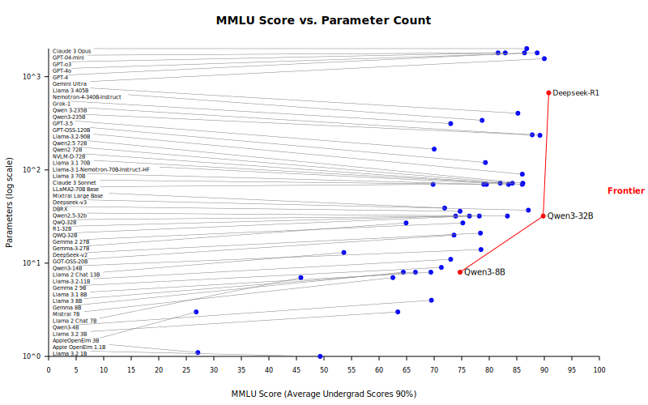

# Parameter Count vs MMLU Score

This graph illustrates the relationship between the number of parameters in various language models and their performance on the MMLU benchmark. The x-axis represents the number of parameters (in billions), while the y-axis shows the MMLU score (in percentage). Each point on the graph corresponds to a specific model, with its name labeled for reference.  

The chart highlights that model scales have diverged into three main groups: small models (under 10B parameters), medium models (10B-100B parameters), and large models (over 100B parameters). For all three of these categories, free and open-source Chinese models are leading the efficient frontier.  

In the early days, larger models tended to achieve higher MMLU scores through a brute-force approach. More compute meant more capability, but newer architectures and training methods have allowed smaller models to take the lead, and at a far lower inference cost.  

The 27 million parameter HRM model performs at about double the capability of OpenAI's 1.7 trillion parameter models; meaning double the score on bleeding edge tests like ARC-AGI-2 at just 0.001% of the cost.  

In the future, this trend will continue as agentic tooling enables smaller models to collaborate in order to outperform larger ones.  

[This graph](https://github.com/cjtrowbridge-com/cjtrowbridge.com/blob/main/ai/mmlu-params/graph.svg) is generated from [this csv file](https://github.com/cjtrowbridge-com/cjtrowbridge.com/blob/main/ai/mmlu-params/data.csv) by [this jupyter notebook](https://github.com/cjtrowbridge-com/cjtrowbridge.com/blob/main/ai/mmlu-params/graph.ipynb). You can download these files and run them yourself, and feel free to submit pull request to [the public repository](https://github.com/cjtrowbridge-com/cjtrowbridge.com/tree/main/ai/mmlu-params) with any additions, refinements, etc.

