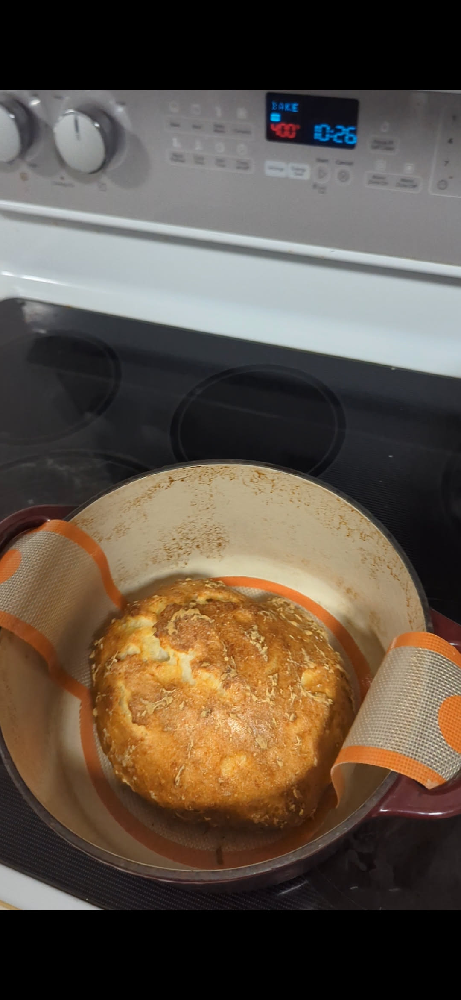

## Ingredients

- 3¼ cups gluten free flour blend (I use Cup4Cup)
- 1 tbsp plus 1 tsp granulated sugar
- 2 tsp salt
- 2 tsp rapid rise (instant) yeast
- 2½ cups soy milk (Works better than cow milk)
- 4 tbsp butter, melted

## Yield: One loaf

## Special Tools

- Dutch oven with lid. [This is the one I use](https://amzn.to/4gpQoMo)
- [Silicone bread sling](https://amzn.to/4fR7YJ6). (This will change your life)

## Instructions

1. Preheat oven to 400°F. Place Dutch oven with lid in the oven to preheat as well.
2. In a large bowl, combine the flour, sugar, salt, and yeast. (Using a mixer works best, but you can also do this by hand.)
3. Add the soy milk and melted butter to the dry ingredients. Mix thoroughly.
4. Pour the mixed dough into a greased bowl and cover with a clean towel. Let it rise for at least 1 hour until it's not liquid. Gently tilt the bowl back and forth and the dough should stay together and not run like a liquid. If it's still liquid, let it rise longer.
5. Once the dough is not runny, put the silicone bread sling on top of the bowl and flip it over so the dough releases from the bowl onto the sling.
6. Open the oven and the dutch oven. Lower the dough sling and dough into the dutch oven. Cover with the lid and bake for 60 minutes.
7. Remove the dutch oven lid, and bake for an additional 30 minutes to brown the top of the bread.
