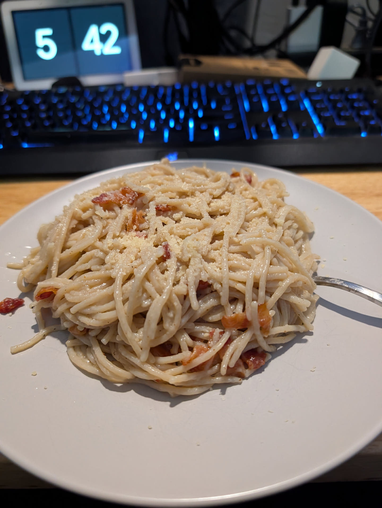

## Ingredients

- 12 ounces gluten-free spaghetti
- 6 egg yolks
- 1 heaping cup of freshly grated Parmesan cheese, plus more for serving
- 2 cups cooked chopped bacon (about 1 lb bacon uncooked, make sure it's gluten-free)
- Freshly cracked black pepper, to taste
- 1 to 1½ cups reserved pasta water, as needed

## Instructions

1. Cook the gluten-free spaghetti in salted water until just al dente. Reserve 1½ cups of the pasta water before draining the spaghetti.
2. In a bowl, whisk together the egg yolks, Parmesan, and a generous amount of black pepper until they form a thick paste.
3. Warm the cooked bacon in a large skillet over medium heat.
4. Add the drained spaghetti to the skillet and toss it with the bacon.
5. Remove the skillet from the heat. Add the egg yolk and Parmesan mixture, then toss continuously to coat the pasta.
6. Add the reserved pasta water a little at a time until the sauce is glossy and coats the spaghetti.
7. Serve immediately with extra Parmesan and freshly cracked black pepper.
