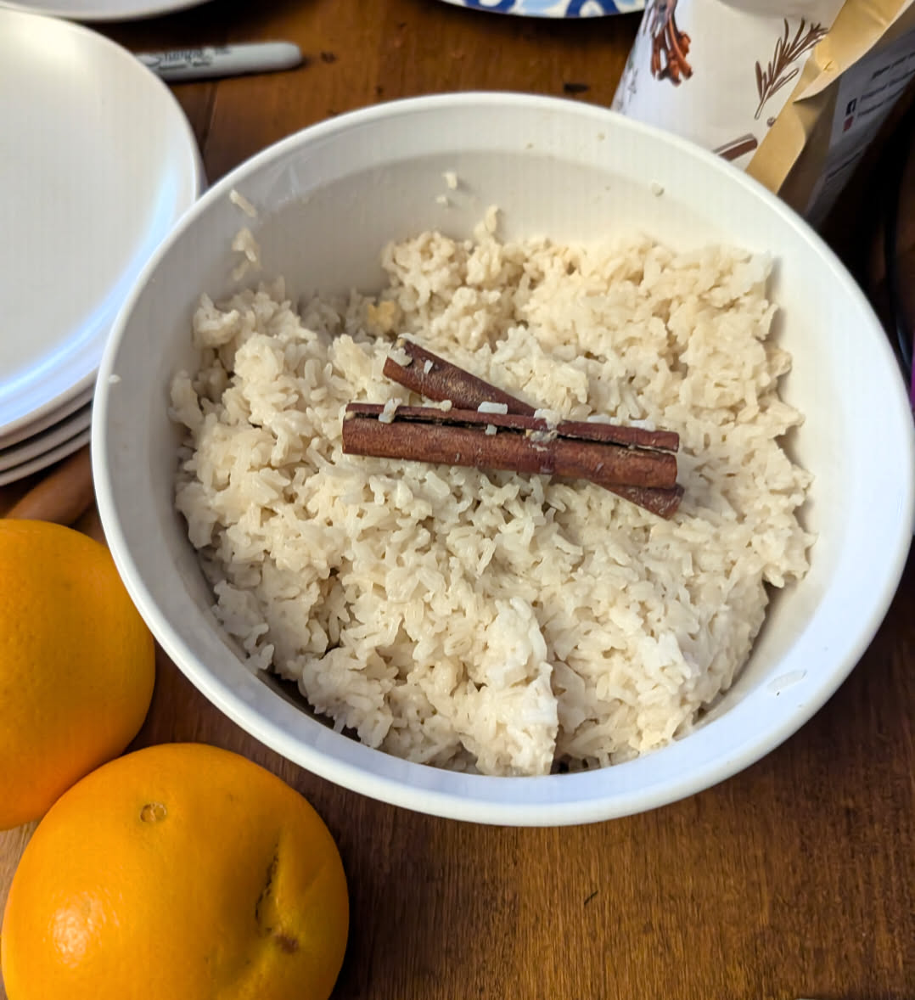

## Ingredients

- 2 cups uncooked white rice
- 3 cups water
- 2 cans full-fat coconut milk
- 1½ cups sugar
- 1 tsp ground cinnamon
- 2 cinnamon sticks

## Instructions

1. Add all ingredients to the Instant Pot and stir well.
2. Cook on high pressure for 10 minutes.
3. Let the pressure release naturally.
4. Remove the cinnamon sticks and stir before serving.

## Note:

This will make the whole house smell amazing. It's delicious, but the smell is half the fun.
