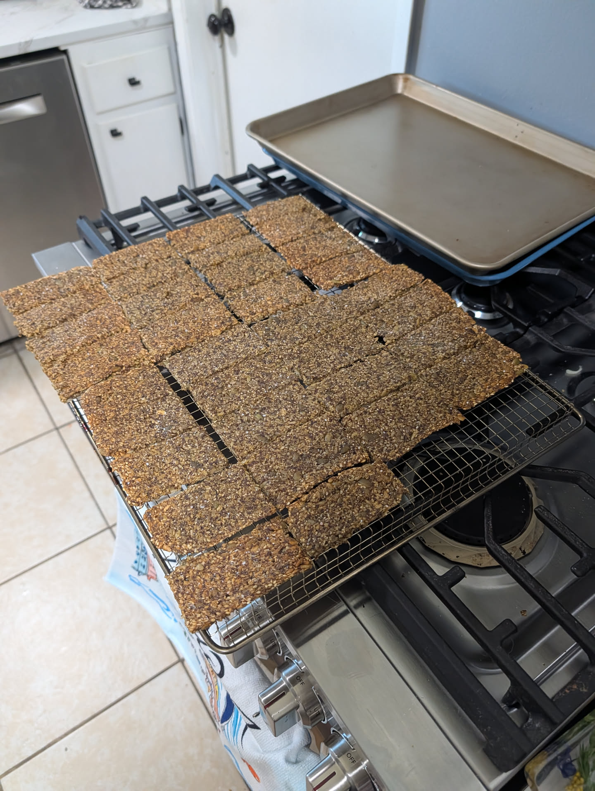

## Ingredients

* ⅔ cup sesame seeds
* 1 cup flaxseeds
* 1 cup raw pumpkin seeds (pepitas)
* 1 cup raw sunflower seeds
* ¼ cup chia seeds
* ⅔ cup cornstarch
* 3–4 Tbsp Thai green curry paste
* 1 Tbsp Better Than Bouillon Roasted Chicken
* 6 Tbsp canola oil
* 1½ cups boiling water
* 1 tsp ground coriander (optional)
* Flaky sea salt, for sprinkling (optional and use sparingly)

## Yield: Two sheets

## Special Tools

- Highly recommend using a [Wire rack](https://amzn.to/3S23OEU) for cooling. This prevents the knekkebrød sheets from cracking randomly, so you can cut them into the shapes and sizes you want.

## Instructions

1. **Preheat the oven to 275°F (135°C).** Line two 13×18-inch rimmed baking sheets with [silicone baking sheets](https://amzn.to/4z5y8PH). (Paper will stick. Once you try these you will never go back.)

2. **Combine the dry ingredients.** In a large bowl, stir together the sesame seeds, flaxseeds, pumpkin seeds, sunflower seeds, chia seeds, cornstarch, and optional ground coriander.

3. **Prepare the curry mixture.** In a separate bowl or large measuring cup, dissolve the Better Than Bouillon in the boiling water. Whisk in the Thai green curry paste until evenly dispersed.

4. **Make the dough.** Add the curry-bouillon mixture and canola oil to the dry ingredients. Stir thoroughly until everything is evenly combined.

5. **Let the mixture rest for 10 minutes.** This gives the chia and flax time to absorb liquid and allows the mixture to thicken.

6. **Divide between the two prepared baking sheets.** Spread the mixture into a thin, even layer on each sheet, leaving a small border around the edges. A damp spatula or small offset spatula works well.

7. **Taste for salt before adding any topping.** The curry paste and Better Than Bouillon both contain substantial salt, so additional salt may not be necessary. If desired, sprinkle the tops very lightly with flaky sea salt.

8. **Bake for about 90 minutes**, rotating the pans and switching their positions partway through baking if necessary for even browning.

9. **Check for crispness.** The knekkebrød should be golden, dry, and crisp throughout. If the centers are still slightly flexible or damp, continue baking in 10–15 minute increments at 275°F.

10. **Cool completely.** Let the crackers cool briefly on the baking sheets, then transfer the parchment and crackers to wire racks. They will continue to crisp as they cool.

11. **Break into rustic pieces** or cut into squares. Cutting works best when the crackers are still slightly warm.

## Notes

* Do **not** add the 1 tsp salt from my [original knekkebrod recipe](../classic-knekkebrod/). The curry paste and chicken bouillon replace it.
